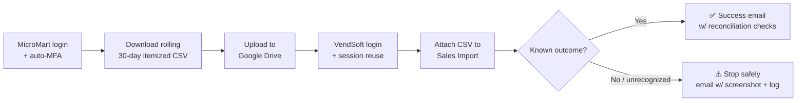

# MicroMart → VendSoft Sales Reconciliation Agent

A daily automation that pulls itemized sales data out of one vendor's dashboard, archives it
to Google Drive, and reconciles it into a second system — end to end, unattended, with MFA,
without a human touching a keyboard.

Built for [Access Amenities](https://www.accessamenities.com), a smart-vending operator, to
close a daily manual chore: someone had to log into MicroMart (the point-of-sale platform for
the vending units), export the previous day's itemized transactions, and hand-import that file
into VendSoft (the operator's inventory/accounting system) — every single morning, without fail.

## What it actually does

Runs daily at 8 AM via macOS `launchd`, entirely on the operator's own machine — no cloud
credential storage, no third-party server ever sees a password.

## Why this shape, not a simpler one

A handful of decisions here were less obvious than "just write a script," and are the more
interesting part of the project:

- **MFA that doesn't block automation.** The MicroMart account requires MFA. Rather than
  disable it or need a human to hand-type a code every morning, the agent computes valid
  TOTP codes itself from a securely-stored secret (`pyotp`) — same math an authenticator app
  runs, minus the phone. SMS-based MFA was ruled out early specifically because it *can't* be
  automated without paying for a receiving service.
- **Fail loud, not silent.** Early testing surfaced a real risk: the destination system
  (VendSoft) sometimes requires a manual machine/product-mapping step before an import
  actually completes. Rather than assume success whenever no exception was thrown, the agent
  explicitly checks for a small set of *known-good* outcomes and treats anything else as a
  stop-and-notify condition — including a screenshot of exactly what it was looking at and the
  relevant slice of the run log. Silently reporting "success" on an import that never actually
  finished would be worse than not automating it at all.
- **Deterministic pipeline, not an LLM driving the browser live.** The actual clicking,
  filling, and file handling is a plain [Playwright](https://playwright.dev/python/) script —
  repeatable and fast. An AI agent was used to *build and diagnose* it (including working out
  UI quirks like a marketing popup intercepting clicks, and a login field implemented as a
  floating `<label>` rather than an HTML `placeholder`, both invisible from a plain screenshot
  glance) — but the thing that runs at 8 AM every day is ordinary, auditable code.
- **Resumable by step, not all-or-nothing.** Every stage (login, download, upload, import) can
  be re-run independently from a checkpoint (`--resume-from <step>`), so a fix to one broken
  step doesn't mean re-doing everything else — including re-uploading a file that already
  landed successfully.
- **Credentials never touch the codebase.** Every password, TOTP secret, and OAuth token lives
  in the local macOS Keychain or a gitignored config file, never in a shell history, chat log,
  or commit.
- **A rolling window instead of a single day.** MicroMart excludes failed-payment rows from a
  day's export entirely, and a payment that fails and is later retried successfully keeps its
  *original* transaction date rather than the retry date — so a single-day pull would
  permanently miss it. Pulling "Last 30 Days" every run instead, relying on VendSoft's own
  per-transaction (not per-file) duplicate detection to make the daily overlap safe, means a
  newly-resolved retry is reconciled within a day of becoming successful.
- **Escalate to headed only when actually needed.** Observed live in production: MicroMart
  blocks headless Chromium logins specifically — five consecutive headless attempts hit an
  account-level block with valid credentials and a valid TOTP code, while the identical login
  succeeded immediately in headed (visible) mode. Rather than run headed every day just to
  dodge a failure mode that's usually absent, the daily job stays headless by default and only
  relaunches the browser headed if a login attempt actually fails — a visible window appears
  only on the days it's needed, not by default.

## Stack

- **Python + [Playwright](https://playwright.dev/python/)** — browser automation
- **[pyotp](https://github.com/pyauth/pyotp)** — TOTP code generation for unattended MFA
- **Google Drive API + Gmail API** (OAuth, minimal scopes: `drive.file`, `gmail.send`) —
  archival upload and HTML email reporting
- **macOS `launchd`** — daily scheduling, with automatic catch-up if the machine was asleep at
  trigger time
- **macOS Keychain** — credential storage

## How it runs

- **Manually**: `.venv/bin/python src/sync.py` (add `--date 09-05-2026` to relabel the output
  filename -- it's not a filter, every run pulls the same rolling 30-day window;
  `--resume-from <step>` to continue after fixing a failure without redoing earlier steps). No
  email report — just runs the pipeline.
- **With reporting**: `.venv/bin/python src/run_daily.py` — same pipeline, labels output by
  today's date automatically, and always sends a success or failure email afterward. This is
  the exact entry point the schedule calls.
- **On a schedule**: a macOS `launchd` LaunchAgent
  (`~/Library/LaunchAgents/com.accessamenities.micromart-vendsoft-sync.plist`) runs
  `run_daily.py` headlessly every day at 8:00 AM. If the Mac is asleep at that moment, `launchd`
  runs it once as soon as the machine wakes rather than skipping the day. If a login attempt
  fails while headless, it automatically retries headed (see Failure handling below) — a visible
  Chrome window only appears when that happens.

Valid `--resume-from` step names: `micromart_login`, `micromart_filter_and_download`,
`upload_to_drive`, `vendsoft_login`, `vendsoft_import`.

## One-time setup

1. `python3 -m venv .venv && .venv/bin/pip install -r requirements.txt && .venv/bin/playwright install chromium`
2. Store credentials in Keychain — see [`config/keychain-setup.md`](config/keychain-setup.md).
3. Set up Google OAuth (Drive + Gmail send) — see
   [`docs/google-drive-oauth-setup.md`](docs/google-drive-oauth-setup.md), then run
   `.venv/bin/python src/authorize_drive.py` once for the interactive consent.
4. Create `config/drive-folder-id.txt` (the target Drive folder's ID) and
   `config/notify-recipients.txt` (one email address per line) — see the adjacent
   `.example.txt` files. These are gitignored since they're environment-specific, not code.

## Failure handling

- Login attempts are capped at 2 tries — **not** retried aggressively, to avoid tripping
  account lockouts on MicroMart or VendSoft. If the first attempt was headless and failed, the
  retry escalates to a headed (visible) browser -- confirmed live that MicroMart blocks headless
  Chromium logins specifically, even with valid credentials and a valid TOTP code.
- On any failure or unexpected crash, the run halts, screenshots whichever browser page(s) were
  open at that moment (`debug-screenshots/`), and logs a resume command — it's designed to
  restart from the failed step, not redo the whole pipeline.
- `run_daily.py` turns all of that into an email: a screenshot of the failure state, the
  relevant slice of the run log (step timeline + every warning/error, not the full log), why it
  failed, and the exact command to resume after fixing it.
- MicroMart's MFA is handled automatically via a stored TOTP secret (`pyotp`) — no phone, no
  manual code entry. `src/totp_code.py` prints a fresh code on demand for manual use (e.g.
  finishing an MFA reset by hand). If a login ever hits an unrecognized screen (e.g. a real
  one-time-code challenge from a *different* auth method), it stops and asks for one manual
  login rather than guessing.
- **Known gap, by design**: a machine/product mapping that's genuinely *unresolved* (VendSoft
  shows a nonzero "Machines/Products to review" count) isn't automated -- the agent only
  auto-clicks the final import confirmation when everything already auto-resolved. An
  unresolved mapping stops safely and asks for a screenshot rather than guessing at a picker UI
  it's never seen.

## MicroMart CSV export behavior (confirmed)

No date filter is applied -- every run downloads "Last 30 Days" (the Download CSV modal's
default when no page-level date filter is set) via the Itemized Sales report type. A 30-day
export can take a minute or more to generate server-side, well past Playwright's normal 30s
default, so that download's timeout is set much higher.

## VendSoft quirks (confirmed)

- Deep-linking straight to the Sales Import URL renders blank for this account — the SPA's
  router expects client-side navigation state a fresh page load doesn't have. The script clicks
  through Configuration → Telemetry → Sales Import instead, same as a human would.
- The login form's "Email or username" / "Password" fields are Angular Material floating
  `<label>`s, not HTML `placeholder` attributes — target them with `get_by_label`, not
  `get_by_placeholder`.
- After attaching a file, VendSoft shows a mapping-review screen with "Machines to review" /
  "Products to review" counts. When both are 0 (everything auto-resolved), an "IMPORT N
  TRANSACTIONS" button appears and gets clicked automatically. A nonzero count means genuine
  manual mapping is needed -- see the known gap above.

## Files

- `src/sync.py` — the deterministic pipeline (login, download, upload, import)
- `src/run_daily.py` — scheduled entry point: runs the pipeline, sends the email report
- `src/email_report.py` — HTML email templates + Gmail API sending
- `src/authorize_drive.py` — one-time Google OAuth consent flow
- `src/totp_code.py` — prints a fresh 6-digit code for any Keychain-stored TOTP secret, for
  manual use (e.g. completing an MFA reset)

## Status

The full pipeline is live and scheduled, including the rolling 30-day pull, Drive archival, and
VendSoft import (both the "already imported" duplicate path and the auto-resolved
machine/product mapping path). A machine/product mapping that's genuinely *unresolved* is
intentionally *not yet* automated — the agent stops and asks for a screenshot the first time it
encounters that screen, rather than guess at UI it's never seen.

## Deferred, by design — do not build or test speculatively

Three pieces have an approved design but are **intentionally not implemented yet**, and should
only be built the first time each scenario genuinely occurs in production — not tested
proactively, not simulated, not triggered on purpose:

- **MFA self-healing recovery flow** (detect a forced recovery-code prompt → use the stored
  recovery code → complete the resulting forced MFA reset → rotate both the TOTP secret and
  recovery code in Keychain automatically → always send an urgent email regardless, since
  recovery-code usage is a security-relevant event even when it self-heals). Design approved.
  **Do not build, wire in, or test this against the real account** outside of an actual live
  occurrence — deliberately triggering it to test it is exactly the kind of repeated-login-churn
  that caused a real account lockout during development. Build it live, from the real screen,
  the first time it's actually needed.
- **Genuinely unresolved machine mapping** (VendSoft shows a nonzero "Machines to review"
  count) — no screenshot exists yet; tabled until it happens naturally.
- **Genuinely unresolved product mapping** (nonzero "Products to review") — same; tabled until
  it happens naturally.
